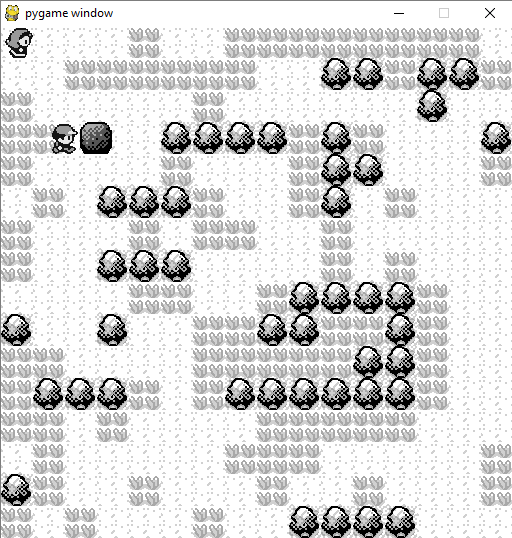

# Tenets
- Exploration: go from map to map, each map is exactly 16x16 tiles.
- Collection
- Reactivity: can skip dialogue. Battle animations are brief, can stack.
- Frequent auto-save
- Art: CGA, gameboy, 4 shades of gray. Using Pokemon Red/Blue assets. 
- Controller or keyboard-only. No mouse. 

# Screenshot

# See also
- [Tuxemon](https://github.com/Tuxemon/Tuxemon/)
- [Sokoban](https://en.wikipedia.org/wiki/Sokoban)
